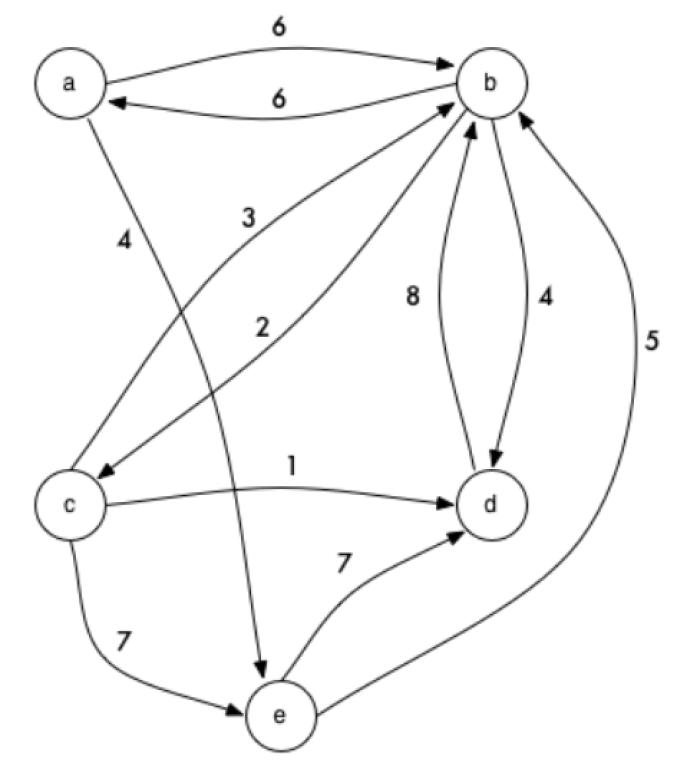

# Lannister Carriage Services: Travelling Salesman problem
    
## Background
  
  
Lannister Carriage Services provides commute and transportation services to a number of
towns in the great land of Westeros. Because of economical reasons and to avoid ambushes,
most routes are "oneway".
That is, a route from Volantis to King's Landing does not imply in a
route from King's Landing to Volantis. In fact, even if both of these routes do happen to exist,
they are distinct and are not necessarily the same distance!


## Story Phase


As a Lannister Carriage Services customer I want to know the available routes between towns
as well as their distances so I can choose the best route for my travel.


## Business Narrative/Scenario

The purpose of this application is to help Lannister Carriage Services provide its customers
information about the routes. In particular, you will compute the distance along a certain route,
the number of different routes between two towns, and the shortest route between two towns.


## Functional / Acceptance Criteria

The input will be given as a directed graph where a node represents a town and an edge represents a route between two towns. The weighting of the edge represents the distance between the two towns. A given route will never appear more than once, and for a given route, the starting and ending town will not be the same town.

The directed graph will be represented as plain text, where the towns are named using letters from the alphabet. A route from town A to town B with distance 5 is represented by the string **AB5**. It also can be represented as JSON:

```javascript
{ 
  "source": "A",
  "target": "B",
  "distance":5
}
```



### Save graph configuration

This endpoint should receive a graph and store it in the database for future references. It should associate an integer identifier to the graph and send it on the response body.

* Endpoint: `http://<host>:<port>/graph`
* HTTP Method: POST
* HTTP Response Code: CREATED
* Contract:
  * Request payload

```javascript
{
  "data":[
    { 
      "source": "A", "target": "B", "distance":6
    },
    { 
      "source": "A", "target": "E", "distance":4
    },
    { 
      "source": "B", "target": "A", "distance":6
    },
    { 
      "source": "B", "target": "C", "distance":2
    },
    { 
      "source": "B", "target": "D", "distance":4
    },
    { 
      "source": "C", "target": "B", "distance":3
    },
    { 
      "source": "C", "target": "D", "distance":1
    },
    { 
      "source": "C", "target": "E", "distance":7
    },
    { 
      "source": "B", "target": "D", "distance":8
    },
    { 
      "source": "E",  "target": "B", "distance":5
    },
    { 
      "source": "E", "target": "D", "distance":7
    }
  ]
}
```

  * Response payload

```javascript
{
  "id" : 1,
  "data":[
    { 
      "source": "A", "target": "B", "distance":6
    },
    { 
      "source": "A", "target": "E", "distance":4
    },
    { 
      "source": "B", "target": "A", "distance":6
    },
    { 
      "source": "B", "target": "C", "distance":2
    },
    { 
      "source": "B", "target": "D", "distance":4
    },
    { 
      "source": "C", "target": "B", "distance":3
    },
    { 
      "source": "C", "target": "D", "distance":1
    },
    { 
      "source": "C", "target": "E", "distance":7
    },
    { 
      "source": "B", "target": "D", "distance":8
    },
    { 
      "source": "E",  "target": "B", "distance":5
    },
    { 
      "source": "E", "target": "D", "distance":7
    }
  ]
}
```

### Retrieve graph configuration

This endpoint should retrieve a previously saved graph from the database. If the graph doesn't exist, should return a NOT FOUND error response.

* Endpoint: `http://<host>:<port>/graph/<graph id>`
* HTTP Method: GET
* HTTP Response Code: OK
* Contract:
  * Request payload: none

  * Response payload

```javascript
{
  "id" : 1,
  "data":[
    { 
      "source": "A", "target": "B", "distance":6
    },
    { 
      "source": "A", "target": "E", "distance":4
    },
    { 
      "source": "B", "target": "A", "distance":6
    },
    { 
      "source": "B", "target": "C", "distance":2
    },
    { 
      "source": "B", "target": "D", "distance":4
    },
    { 
      "source": "C", "target": "B", "distance":3
    },
    { 
      "source": "C", "target": "D", "distance":1
    },
    { 
      "source": "C", "target": "E", "distance":7
    },
    { 
      "source": "B", "target": "D", "distance":8
    },
    { 
      "source": "E",  "target": "B", "distance":5
    },
    { 
      "source": "E", "target": "D", "distance":7
    }
  ]
}
```

### Find available routes from a given pair of towns on saved graph

This endpoint should compute all available routes from any given pair of towns within a given maximum number
of stops in a previously saved graph. If there's no available routes, the result should be an empty list. In case the parameter "maxStops" is not provided, you should list all routes for the given pair of towns. If the graph doesn't exist in the database, it should return a NOT FOUND error response.

For instance, in the graph (AB5, BC4, CD8, DC8, DE6, AD5, CE2, EB3, AE7), the possible routes from A to C with maximum of 3 stops would be: ["ABC", "ADC", "AEBC"]

* Endpoint: `http://<host>:<port>/routes/<graph id>/from/<town 1>/to/<town 2>?maxStops=<maximum number of stops>`
* HTTP Method: POST
* HTTP Response Code: OK
* Contract:
  * Request payload: none
  * Response payload

```javascript
{
  "routes": [
    {
      "route": "ABC",
      "stops": 2
    },
    {
      "route": "ADC",
      "stops": 2
    },
    {
      "route": "AEBC",
      "stops": 3
    }
  ]
}
```

### Find distance for path on saved graph

This endpoint should receive a ordered list of towns and retrieve the total distance on walking through the list of towns in the order they appear on the request in a previously saved graph. If the list of towns is empty or has a single element, the result should be zero. If there's no path described by the list of towns, the result should be -1. If the graph doesn't exist in the database, it should return a NOT FOUND error response.

* Endpoint: `http://<host>:<port>/distance/<graph id>`
* HTTP Method: POST
* HTTP Response Code: OK
* Contract:
  * Request payload

```javascript
{
  "path":["A", "B", "C", "D"]
}
```

  * Response payload

```javascript
{
  "distance" : 9
}
```

### Find distance between two towns on saved graph

This endpoint should find the shortest path between two towns in a previously saved graph. If the start and end town are the same, the result should be zero. If there's no path between these towns, it should be -1. If the graph doesn't exist in the database, it should return a NOT FOUND error response.

* Endpoint: `http://<host>:<port>/distance/<graph id>/from/<town 1>/to/<town 2>`
* HTTP Method: POST
* HTTP Response Code: OK
* Contract:
  * Request payload: none

  * Response payload

```javascript
{
  "distance" : 8,
  "path" : ["A", "B", "C"]
}
```

## Test Data

Input graph:
AB5, BC4, CD8, DC8, DE6, AD5, CE2, EB3, AE7

Test cases:
1. Distance of route ABC: 9
2. Distance of route AD: 5
3. Distance of route ADC: 13
4. Distance of route AEBCD: 22
5. Distance of route AED: NO SUCH ROUTE
6. Routes starting at C and ending at C with a maximum of 3 stops: 
	- CDC  (2 stops)
	- CEBC (3 stops)
7. Routes starting at A and ending at C with a maximum of 4 stops:
	- ABC   (2 stops)
	- ADC   (2 stops)
	- AEBC  (3 stops)
	- ADEBC (4 stops)
8. Shortest route (by distance) from A to C: ABC  (distance = 9)
9. Shortest route (by distance) from B to B: B (distance = 0)